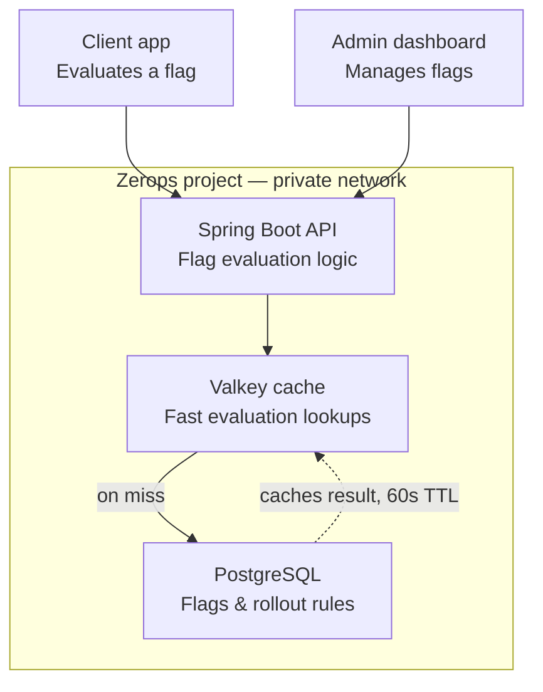

# FlagForge

A high-performance Feature Flag Service that lets developers turn application features on and off remotely — with deterministic percentage-based rollouts — without redeploying code.

Built solo in 48 hours for [The Zerops Challenge](https://www.wemakedevs.org/hackathons/zerops).

**Live demo:** https://api-2b99-8080.prg1.zerops.app
**Demo video:** _[add your video link]_

---

## What it does

Normally, turning a feature on/off or rolling it out to a subset of users means changing code and redeploying. FlagForge removes that step — flip a switch on the dashboard, and the change is live instantly for any app calling the evaluation endpoint.

- Create and manage feature flags per project
- Toggle flags on/off instantly
- Roll a flag out to a percentage of users, with deterministic bucketing (same user always gets the same result)
- Evaluation endpoint is cache-first — checks Valkey before Postgres, and auto-invalidates on update
- Live playground in the dashboard to test evaluations against any user ID
- A small client SDK for consuming apps

---

## Architecture



**How evaluation works:**
1. A client calls `/api/evaluate/{flagKey}` with a `userId`.
2. The service checks Valkey for a cached result (`eval:{projectApiKey}:{flagKey}:{userId}`).
3. On a cache hit, it returns immediately.
4. On a miss, it queries PostgreSQL, computes a deterministic bucket via `hash(userId + flagKey) % 100`, compares it against the flag's rollout percentage, caches the result (60s TTL), and returns it.
5. Updating or deleting a flag immediately invalidates its cache entry, so evaluations never serve stale data.

---

## Tech stack

| Layer | Technology |
|---|---|
| Backend | Java 21, Spring Boot 3.x |
| Database | PostgreSQL |
| Cache | Valkey (Redis-compatible) |
| Frontend | Plain HTML, CSS, JavaScript |
| Build | Maven |
| Deployment | Zerops |

All three services (API, Postgres, Valkey) run inside a single Zerops project, connected over its private network.

---

## Features

- **Project management** — each project gets an auto-generated API key (`ff_live_...`)
- **Flag CRUD** — create, list, update, delete flags per project
- **Percentage rollout** — deterministic hash-based bucketing, no per-request randomness
- **Cache-first evaluation** — Valkey checked before Postgres on every lookup
- **Automatic cache invalidation** — flag updates/deletes clear the relevant cache entry
- **Admin dashboard** — dark-mode UI with toggle switches, rollout sliders, and a live evaluation playground showing response time and cache source (CACHE vs DATABASE)
- **Client SDK** (`js/sdk.js`) — a small `FeatureFlagSDK` class with local caching for consuming apps
- **Unit tests** — 5 tests covering disabled flags, 0%/100% rollout, hash stability, and a 1000-user statistical distribution check

---

## API endpoints

```
POST   /api/projects                        Create a project → returns { id, name, apiKey }
GET    /api/projects/{id}                    Get project details

POST   /api/flags                            Create a flag
GET    /api/flags?projectId={id}             List all flags for a project
GET    /api/flags/{id}                       Get a single flag
PUT    /api/flags/{id}                       Update a flag (toggle, change rollout %)
DELETE /api/flags/{id}                       Delete a flag

GET    /api/evaluate/{flagKey}?projectApiKey={apiKey}&userId={userId}
                                              Evaluate a flag for a user (cache-first)
```

---

## Project structure

```
feature-flag-service/
├── pom.xml
├── zerops.yml
├── README.md
├── src/
│   ├── main/
│   │   ├── java/com/featureflags/
│   │   │   ├── FeatureFlagServiceApplication.java
│   │   │   ├── config/          # Redis + CORS config
│   │   │   ├── entity/          # JPA entities
│   │   │   ├── repository/      # Spring Data repositories
│   │   │   ├── dto/             # Request/response objects
│   │   │   ├── service/         # Business logic (evaluation, caching)
│   │   │   ├── controller/      # REST controllers
│   │   │   └── util/            # API key generation
│   │   └── resources/
│   │       ├── application.yml
│   │       └── static/          # Dashboard (HTML/CSS/JS) + client SDK
│   └── test/
│       └── java/com/featureflags/
│           └── EvaluationServiceTest.java
```

---

## Running locally

```bash
# requires a running Postgres + Redis/Valkey instance
export DB_HOST=localhost
export DB_PORT=5432
export DB_NAME=flagforge
export DB_USER=postgres
export DB_PASS=postgres
export REDIS_HOST=localhost
export REDIS_PORT=6379

mvn clean package -DskipTests
java -jar target/feature-flag-service-1.0.0.jar
```

The dashboard is served at `/` once the app is running.

---

## Deployment (Zerops)

The project deploys as three services inside one Zerops project (`ToggleFlow`), connected over the private network:

- `db` — PostgreSQL
- `cache` — Valkey
- `api` — the Spring Boot service, built and deployed via `zerops.yml`

```yaml
zerops:
  - setup: api
    build:
      base: java@21
      buildCommands:
        - mvn clean package -DskipTests
      deployFiles: target/*.jar
    run:
      base: java@21
      ports:
        - port: 8080
          httpSupport: true
      envVariables:
        DB_HOST: db
        DB_PORT: 5432
        DB_NAME: ${db_dbName}
        DB_USER: ${db_user}
        DB_PASS: ${db_password}
        REDIS_HOST: cache
        REDIS_PORT: 6379
      start: java -jar target/*.jar
```

---

## Testing

```bash
mvn test
```

5/5 tests passing, covering:
- Disabled flag → returns `false`
- 100% rollout → returns `true`
- 0% rollout → returns `false`
- Deterministic hash bucket stability across repeated calls
- Statistical distribution across 1000 simulated users (~target rollout %)

---

## Built for The Zerops Challenge

By Shivam — with Kunal Kushwaha and Francesco Ciulla hosting.